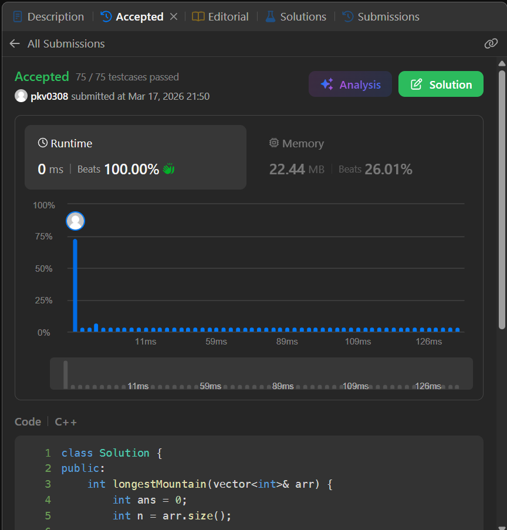
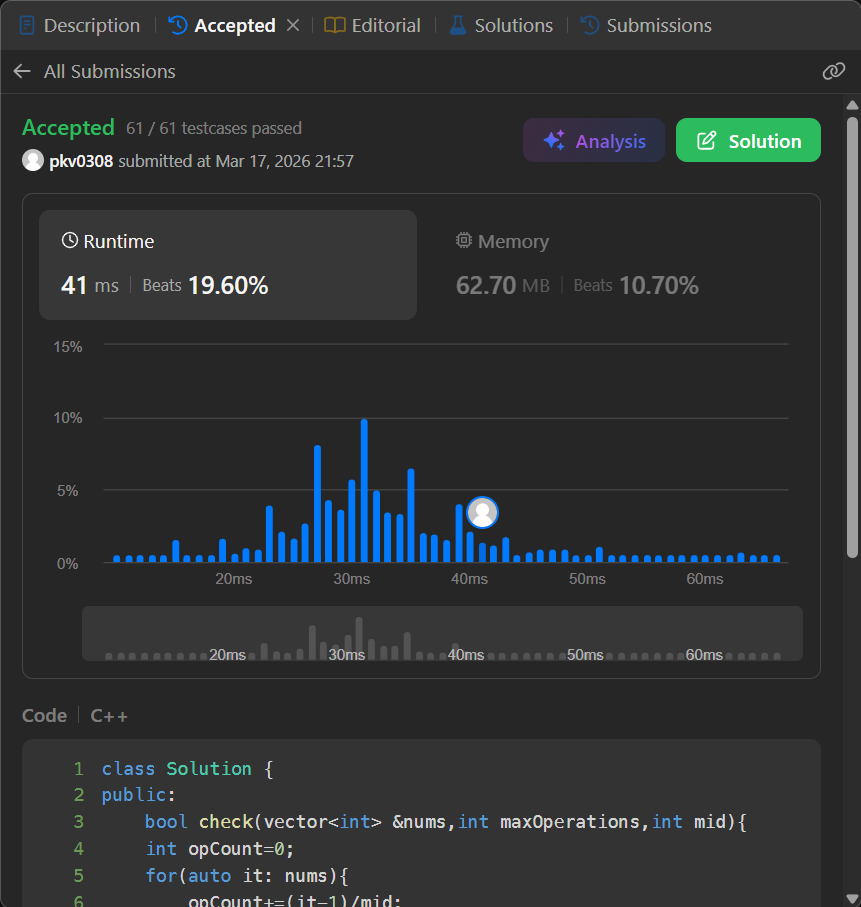

# Practical Lab MST Competitive Programming

# Student Details
* Name: Prateek Verma
* UID: 25MCC20062
* Class: 25MCC 101 - A

## Question 1: Leetcode 845 --> Longest Mountain in Array

```cpp
int longestMountain(vector<int>& arr) {
        int ans = 0;
        int n = arr.size();

        if (n < 3)
            return 0;
        for (int i = 1; i < n - 1; i++) {
            if (arr[i] > arr[i - 1] && arr[i] > arr[i + 1]) {

                int left = i;
                int right = i;

                while (left > 0 && arr[left] > arr[left - 1]) {
                    left--;
                }

                while (right < n - 1 && arr[right] > arr[right + 1]) {
                    right++;
                }

                ans = max(ans, right - left + 1);
            }
        }
        return ans;
    }
```




## Question 2 : Leetcode 1760 -->  Minimum Limit of Balls in a Bag

```cpp
bool check(vector<int> &nums,int maxOperations,int mid){
    int opCount=0;
    for(auto it: nums){
        opCount+=(it-1)/mid;
        if(opCount>maxOperations){
            return false;
        }
    }
    
    return true;
}

int minimumSize(vector<int>& nums, int maxOperations) {
        vector<int> copy(nums.begin(),nums.end());
        int low=1;
        int high=1e9;
        int ans;
        while(!(low>high)){
            int mid=low+(high-low)/2;
            if(check(nums,maxOperations,mid)){
                high=mid-1;
                ans=mid;
            }
            else{
                low=mid+1;
            }
        }

        return ans;

    }
```


